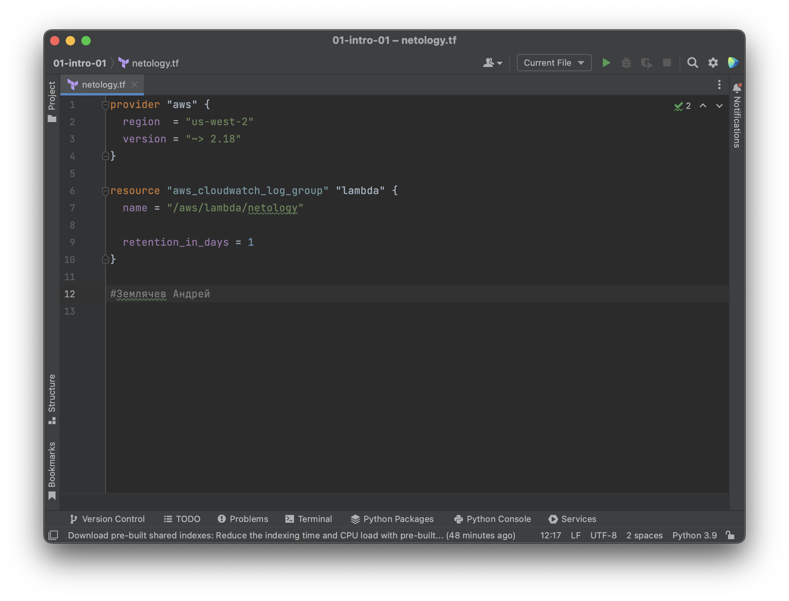
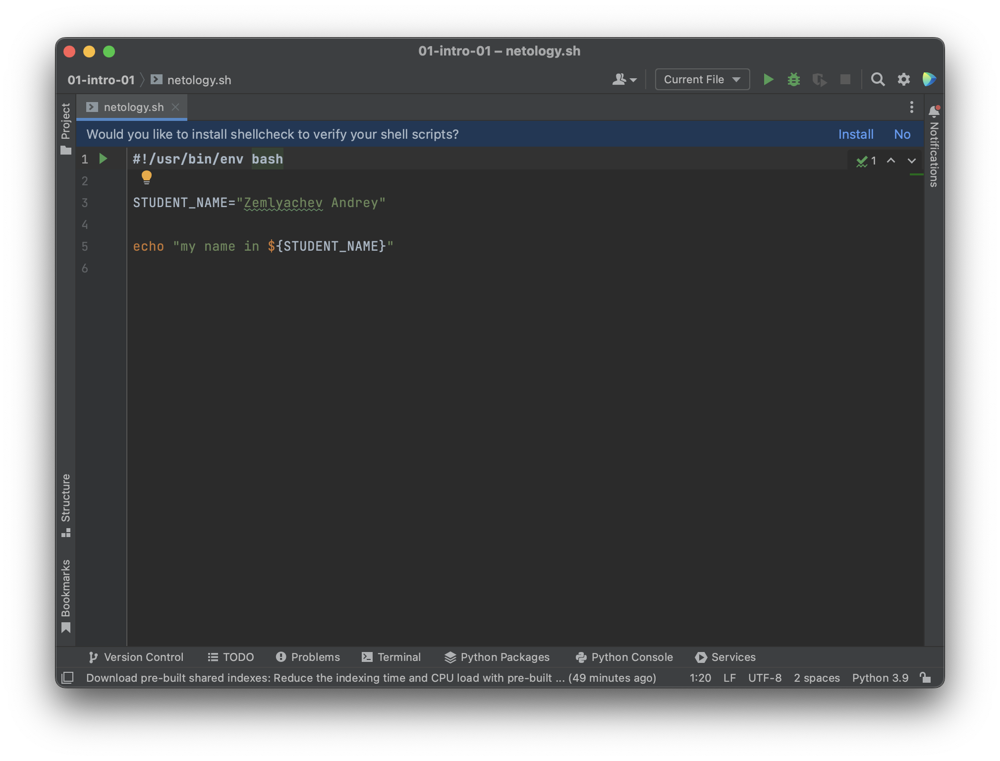
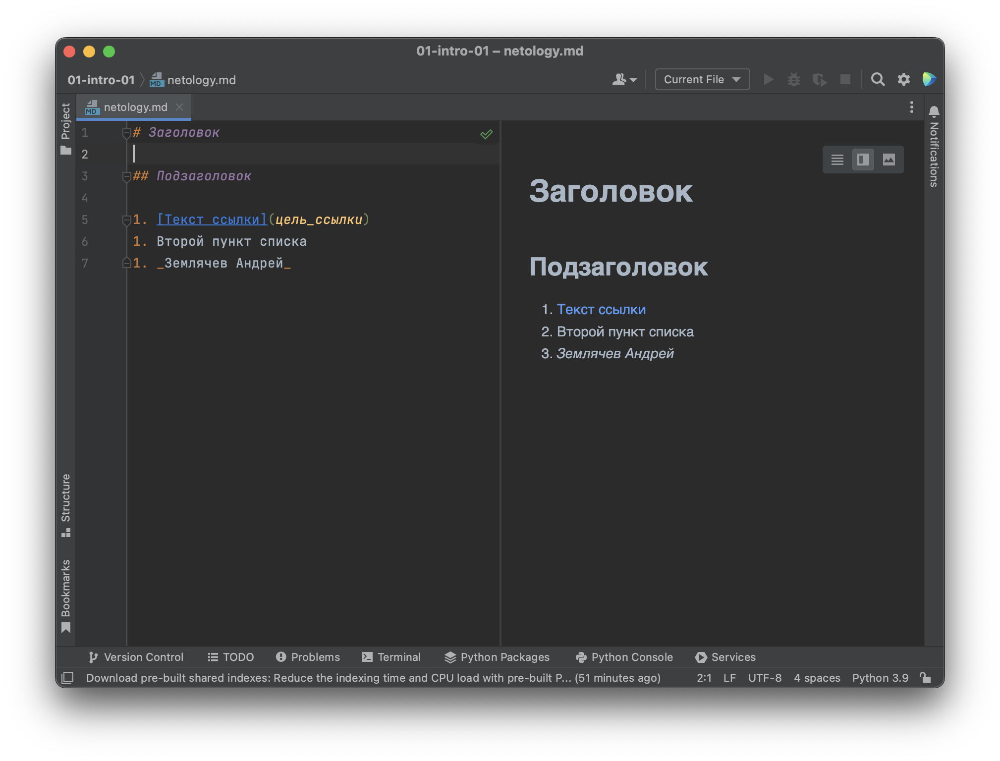
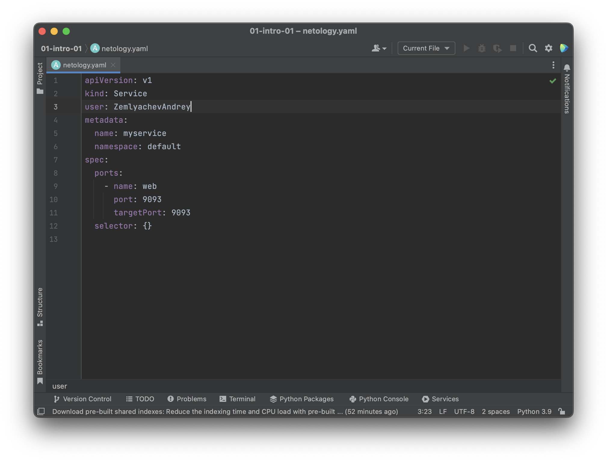
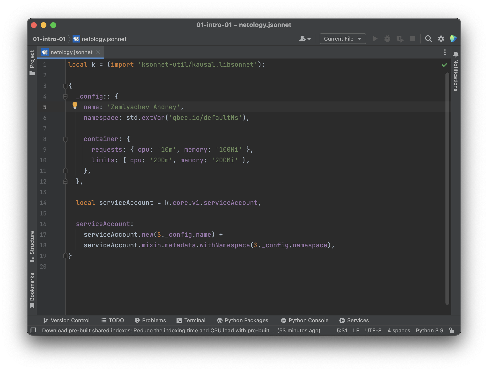

# Домашнее задание к занятию «1.1. Введение в DevOps»

## Задание №1 - Подготовка рабочей среды

- Terraform: 
- Bash: 
- Markdown: 
- Yaml: 
- Jsonnet: 

## Задание №2 - Описание жизненного цикла задачи (разработки нового функционала)

1. Задача планируется и согласовывается менеджером
2. После согласования Разработчики кодируют решение
3. При участии DevOps решение собирается на тестовую среду для Тестирования
4. Тестирование задачи
5. Если Тестеры и Менеджер согласовали, то Релиз, иначе продолжаем кодирование
6. DevOps конфигурирует разворачивание релиза с новым функционалом
7. Клиенты увидели новое (этап эксплуатации) / и мониторинга (сбор логов)

